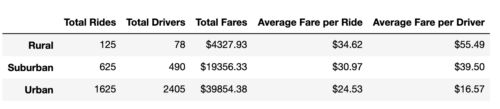
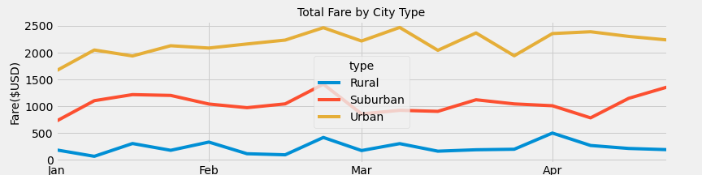

# PyBer_Analysis

## Overview

The purpose of the this analysis is to create a summary DataFrame of the ride-sharing data by city type. Then, using Pandas and Matplotlib, you’ll create a multiple-line graph that shows the total weekly fares for each city type

## Results

In urban type cities, there are most rides and total fares. in rural cites, average fare per ride and average fare per driver are higher.

The image indicates, urban area has highest total fare, and rural area has lowest total fares.
## Summary
According to above analysis, running business in urban area might be a better choice, because it can get more income.